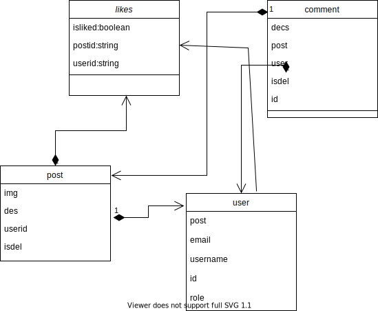
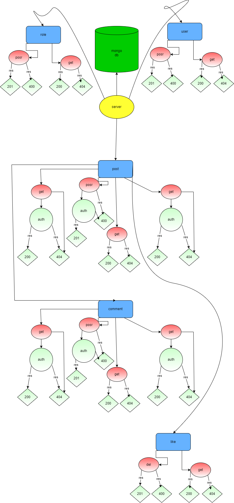

=======
# social media backend

packages used :
nodemon: v2.0.15 ,
mongoose: v6.0.13,
jsonwebtoken: v8.5.1 ,
express: v4.17.1 ,
dotenv: v10.0.0 ,
cors: v2.8.5,
bcrypt: v5.0.1.

install:
I-Clone git clone https://github.com/Haithamsaleh/w08d02.git 
II-for node_modules "npm i"
>>>>>>> a1f22406037d0fb10c630fb0f01c100f38d5824c

========================
